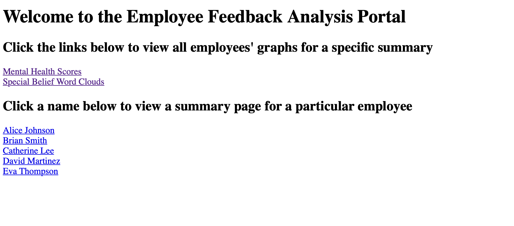
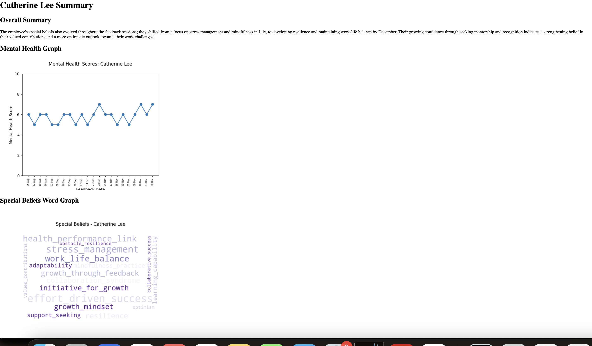

# Employee Feedback Analysis Portal

## Find the portal at...

https://employee-insight.vercel.app

## Reflections on this project

I wanted to provide some insight into my process and reflections on this project, what I learned, and what I would like to do further.\
Overall, I learnt a lot (starting from a level of 0!) about Flask, Jinja templates, and writing very basic HTML. I also learnt how to deploy an app on Vercel. Surprisingly to me, I also learnt a few things about LLM prompting. This was surprising since I thought I was fairly experienced with this, but I had to contend with issues like the LLM forgetting my instructions, figuring out how to receive structured data from the LLM, and making sure it provided answers at each of the regular intervals I was requesting.

**1. Timeline**
Overall, this took me eight hours on Sunday, and an additional 1.5 hours on Monday morning.

**2. Things that can be improved**\
Here are some things that I think could be improved, given a different timeline.
* The data structures: The formatting of output files got a bit messy and inefficient as I was just manipulating the data how I needed it as I went along. A MUCH better approach would be to create a single json or csv output file for each employee that provides easy lookup of results. 
* The appearance of the webpage - it is right now literally a bare bones html webpage. The overall polish could be greatly improved by implementing some styling with CSS or adding dynamic elements with Javascript.
* I think some additional pages in the website could have been interesting - I would like to have added one that maintains a list of employees that are currently at severe mental health risk, judging by their most recent scores. Another interesting one would've been suggested goal setting or targets for employees based on their special beliefs - what they can work on.
* Fixing the raw data in the employee page: I dumped the raw data at the bottom of the personalized employee pages, with the intention of creating some sort of list or tabular feedback - this is ultimately unfinished.
* Optimizing openai usage (tokens).

**3. Approach to the data**\
I did not actually do a lot of preprocessing on the data. I instead wrote a comprehensive prompt telling GPT exactly how to interpret the employee feedback. Minimal processing was done and the data was _essentially_ given to GPT as-is.\
I asked GPT to generate a mental health score for each employee on each feedback session, from a scale of 0 to 10. I explained 0 is a mental health crisis, 10 is excellent mental health, and 5 is some concerns with mental health. I also asked it to highlight key beliefs in each feedback session, based on the beliefs file provided.\
GPT is also prompted to provide a two-sentence summary rationalizing its choices and explaining how the employee's beliefs and mental health changed over the period of feedbacks provided.\
I then created (1) a scatter plot of mental health scores over time, and (2) a word cloud highlighting prominent special beliefs.

## About the Code
* NOTE ON REQUIREMENTS: requirements.txt is used for deployment (app.py). requirements_other.txt contains full package dependencies, needed to run the data analysis bits.
* sentiment.py : Load the feedback, acquire and save responses from ChatGPT.
* analyse_results.py : Process response from ChatGPT, create graphs and output final results files.
* var.py: Holds system prompt for GPT.
* get_jsons.py: Flask backend to return json results for interface to consume. This is not used in the final deploy - the functions are moved to app.py.
* app.py: Create the web interface.

## Other files/folders
* /data: Holds the data sources.
* /graphs: Holds output graphs.
* /summaries: Holds text summaries of results.
* /templates: Holds the html templates.

## Notes to run
* pip install requirements.txt
* For AI analysis: Create a .env file with the parameter OPEN_AI_API_KEY .
* For website: Deployed on vercel. If wanting to run locally, change our_base on line 11 of app.py, and remove port from app.run on line 119.

## About the Site

* Landing Page: Navigate to either mental health or special belief graphs for all employees.\
Select a specific employee to view a comprehensive summary for.

* View a two sentence summary of the employee's feedback, focusing on mental health and specific beliefs. Also includes mental health graphs and word cloud of specific beliefs. 